# 基于 DCT 的数字水印视频嵌入

东南大学《网络信息安全与信息隐藏》课程实验

## 嵌入方式

- 离散余弦变换（DCT变换）
> 它能将空域信号转换到频率上表示，并能够比较好的去除相关性。
> 对于图像来说，空域是平时看到的图像，频率是图像做完DCT变换之后的数据。
> DCT变换是对残差块做的，通常情况下是在4X4的子块上进行变换的

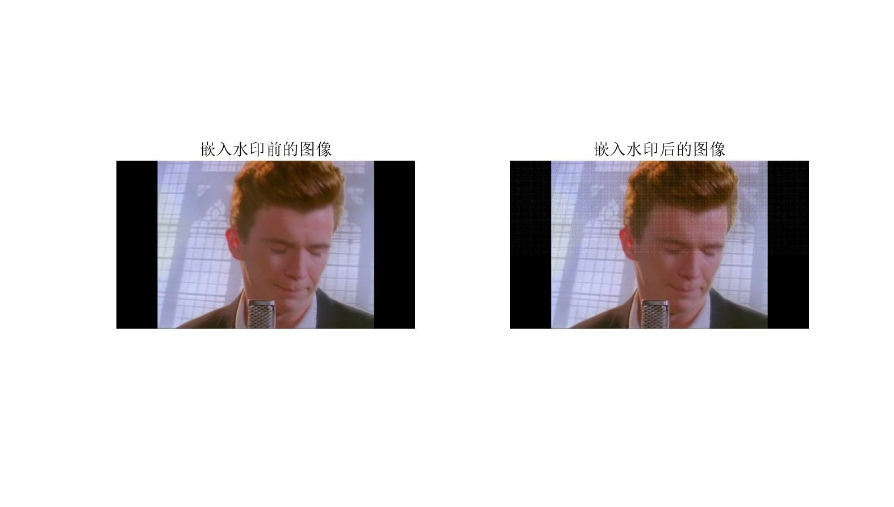

## 图片评价标准

- PSNR

  PSNR的单位为dB，PSNR越大，代表着图像质量越好。

- SSIM

  SSIM取值范围为[0,1]，值越大表示输出图像和无失真图像的差距越小，即图像质量越好。

- 余弦相似度

  一个向量空间中两个向量夹角间的余弦值作为衡量两个个体之间差异的大小，余弦值接近1，夹角趋于0，表明两个向量越相似，余弦值接近于0，夹角趋于90度，表明两个向量越不相似。 

## 加密方式

- Arnold置换
> Arnold变换是图像加密领域的一个经典置乱算法，所谓置乱，就是打乱图片上各个像素点的位置，以消除原图片相邻像素间的相关性。


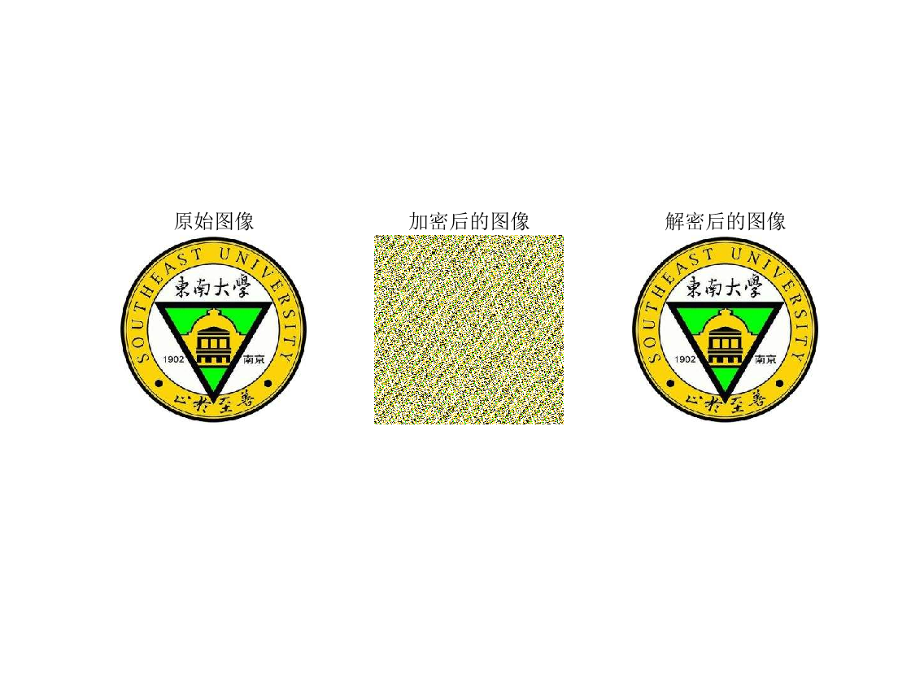

## 攻击方式

* 向指定图片中添加标准差为 std 的高斯噪声

> std = 0.05
>
> PSNR = 5.71
> SSIM = 14.42%
> 余弦相似度 = 0.8437
>
> 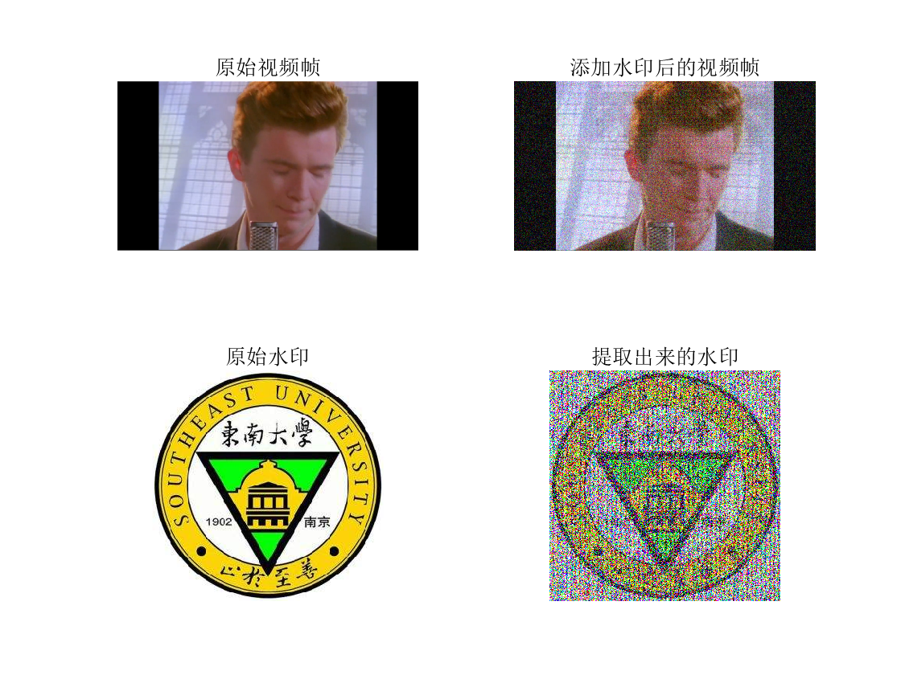

* 在图片中添加椒盐噪声

> density = 0.05
>
> PSNR = 5.86
> SSIM = 15.86%
> 余弦相似度 = 0.8800
>
> 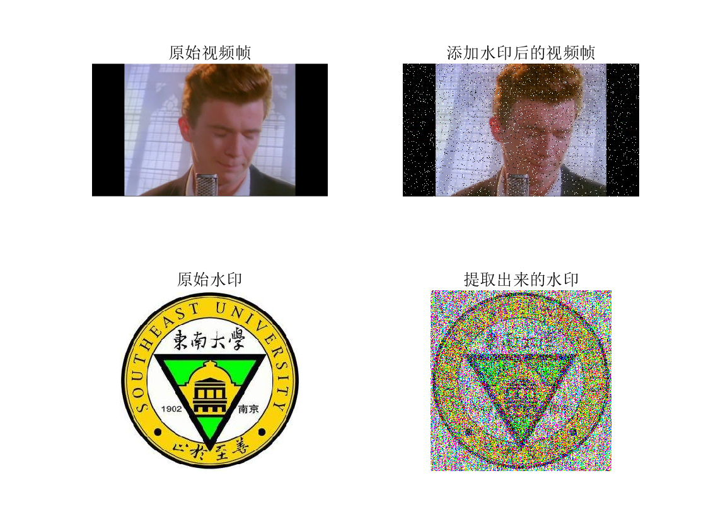

* 随机选取图片中1个颜色通道置为零

> RH = 100, RW = 100
>
> PSNR = 7.00
> SSIM = 45.61%
> 余弦相似度 = 0.7730
>
> 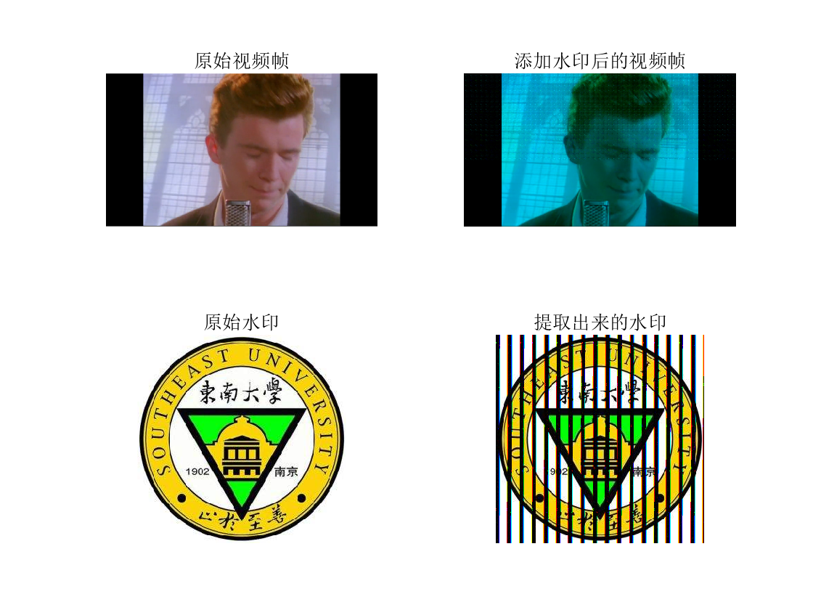

* 随机裁剪一张RGB格式图片

> PSNR = 13.88
> SSIM = 61.29%
> 余弦相似度 = 0.9921
>
> 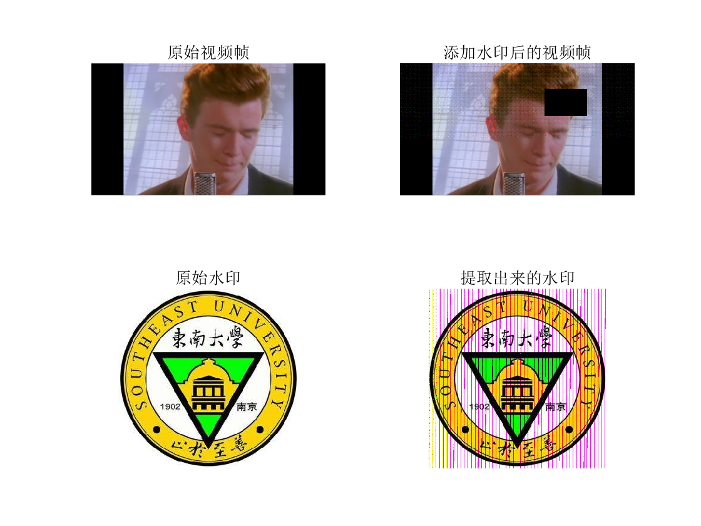

* 旋转图片

> 旋转10°
>
> PSNR = 3.16
> SSIM = 1.84%
> 余弦相似度 = 0.2949
>
> 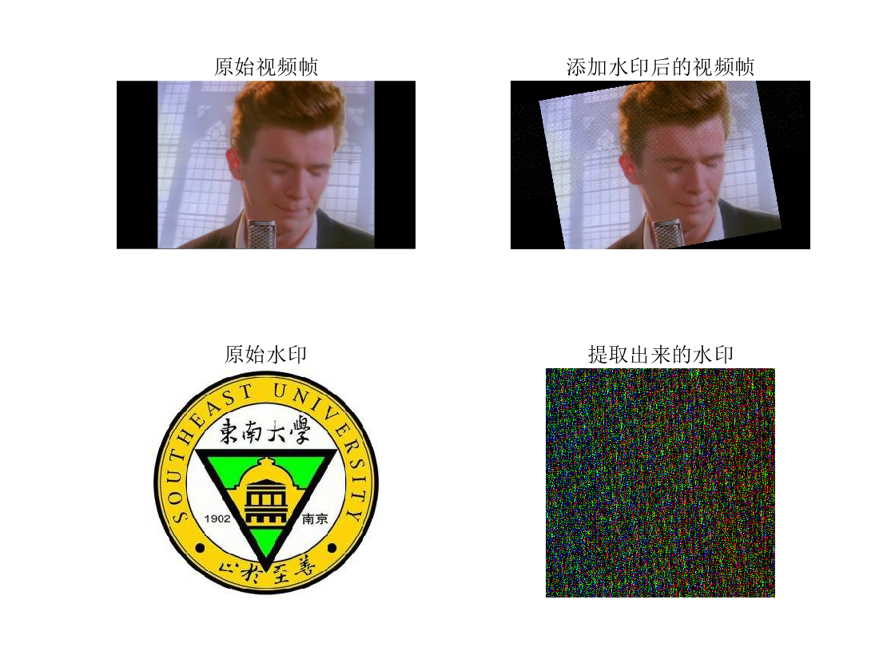
>
> 再旋转 -10°
>
> PSNR = 11.83
> SSIM = 53.47%
> 余弦相似度 = 0.8910
>
> 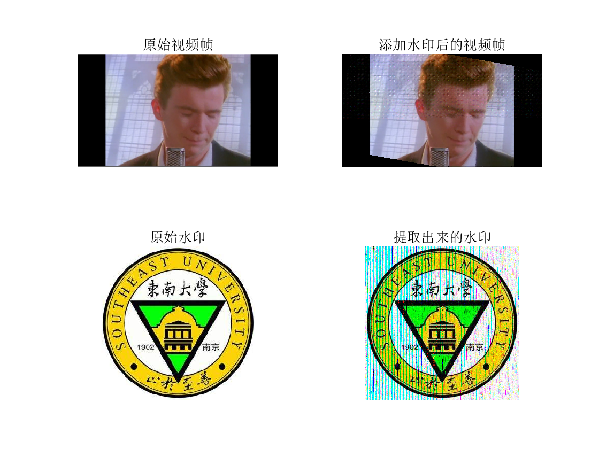

* 最大池化操作

> 采用 $3*3$ 矩阵对原图片进行最大值池化压缩，多余的行列被废弃
>
> PSNR = 3.02
> SSIM = 2.62%
> 余弦相似度 = 0.3025
>
> 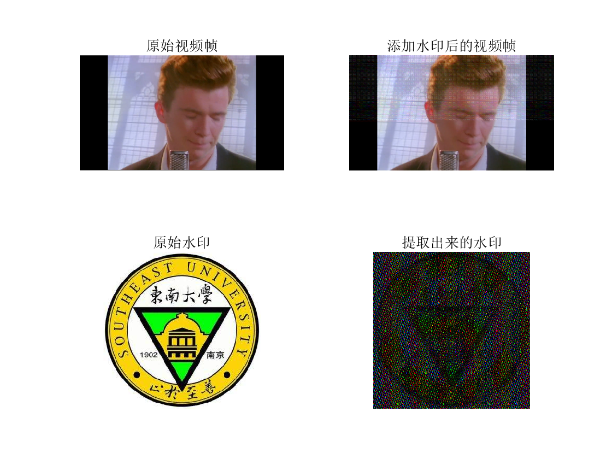

## 存在问题&解决方法

完成DCT变换后得到的图像矩阵为double型，范围在`(-0.1032,1.1208)`之间。

但是matlab保存图片时会将其先压缩为`[0,1]`然后再转为0~255，会导致DCT的精度缺失，并影响最终水印提取效果。

> 默认解决方法
>
> PSNR = 6.86
> SSIM = 21.79%
> 余弦相似度 = 0.3999
>
> 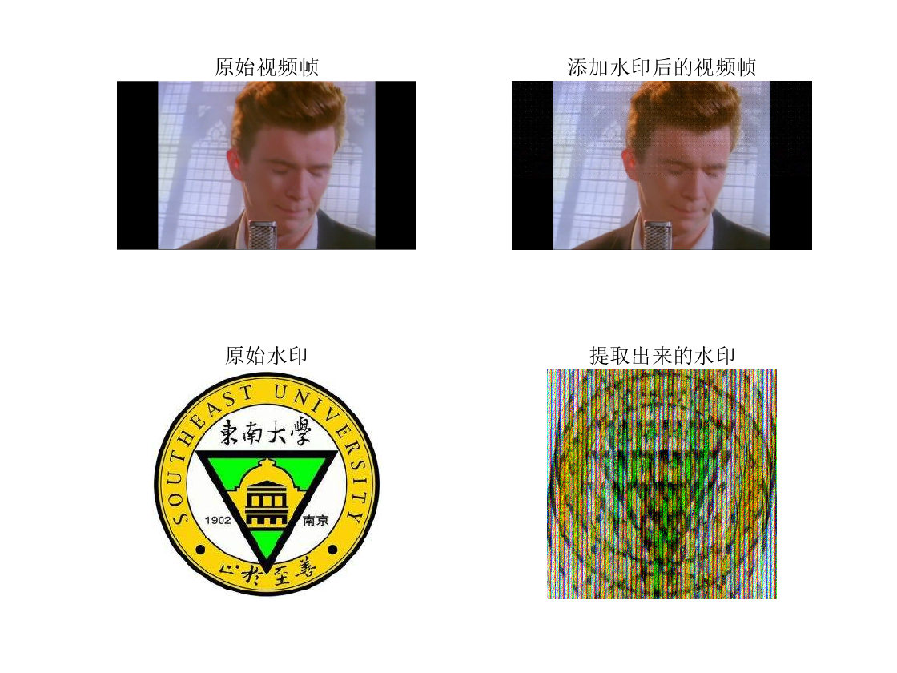

```matlab
% 通过以下变换暂时提高了水印效果

% frame = im2uint8(frame); % double 图像转换为 uint8
frame(:,:,:)=(frame(:,:,:)+0.1032)/1.224*255;
frame=uint8(frame);

% frame = im2double(frame); % 转换为实数值
frame=double(frame);
frame(:,:,:)=frame(:,:,:)/255*1.224-0.1032;
```

> 改进后提取出来的效果如下，图片的构图稍微复杂一点就会导致难以识别
>
> PSNR = 2.82
> SSIM = 1.45%
> 余弦相似度 = 0.2831
>
> 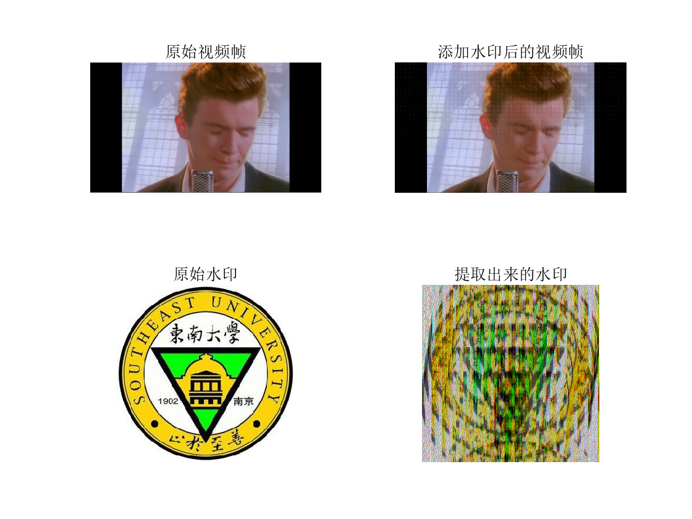

## 总结

### 优势

- DCT变换，抗干扰能力强
- 多颜色通道水印嵌入，不会丢失颜色信息，可以用于提取彩色水印

* 采用 Arnold 置乱水印，充分保护水印信息

### 增补空间

- 解决DCT精度问题，提高水印提取准确度
- 实现将彩色视频作为水印嵌入
- 利用深度学习还原清晰原始水印

## 实现的功能

| 文件名               | 函数                                                         | 功能                                                         |
| -------------------- | ------------------------------------------------------------ | ------------------------------------------------------------ |
| AddGaussianNoise.m   | `after_picture = AddGaussianNoise(picture, std)`             | 向指定图片中添加标准差为 `std` 的高斯噪声                    |
| AddSaltPepperNoise.m | `after_picture = AddSaltPepperNoise(image, density)`         | 在图片中添加椒盐噪声                                         |
| RandomChannelCover.m | `after_picture = RandomChannelCover(picture)`                | 随机选取图片中1个颜色通道置为零                              |
| CutPicture.m         | `after_picture = CutPicture(pic)`                            | 随机裁剪一张RGB格式图片                                      |
| RotatePicture.m      | `after_picture = RotatePicture(pic, angle)`                  | 旋转图片                                                     |
| MaxPool.m            | `after_picture = MaxPool(img)`                               | 最大池化操作                                                 |
| ReadWatermark.m      | `watermark = ReadWatermark(filepath)`                        | 从文件路径 `filepath` 中读取并返回水印图片                   |
| AddWatermark.m       | `after_picture = AddWatermark(picture, watermark, alpha)`    | 向指定图片中嵌入水印并返回嵌入后图片，嵌入强度为 `alpha`     |
| ExtractWatermark.m   | `watermark=ExtractWatermark(after_picture, picture, alpha, MW, NW)` | 从指定图片中提取水印，要求给出水印的长 `MW`、水印的宽 `MW` 以及嵌入强度 `alpha` |
| Gray2Rgb.m           | `rgb=Gray2Rgb(gray)`                                         | 将灰度图片的三个通道组合为 RGB 图片                          |
| VideoPrcess_input.m  | `frames = VideoProcess_input(alpha, video, watermark, TOTAL)` | 向视频每一帧添加水印                                         |
| VideoPrcess_output.m | `VideoProcess_output(alpha, video, watermark, frames)`       | 处理视频并提取水印                                           |
| ImSimilar.m          | `similarity = ImSimilar(pic1, pic2)`                         | 计算两张图片的余弦相似度                                     |
| Arnold.m             | `arnold_img = Arnold(img, a, b, n)`                          | Arnold置换算法                                               |
| ReArnold.m           | `img = ReArnold(arnold_img, a, b, n)`                        | 对Arnold变换后的图像进行逆操作                               |
| main.m               | -                                                            | 主函数                                                       |

